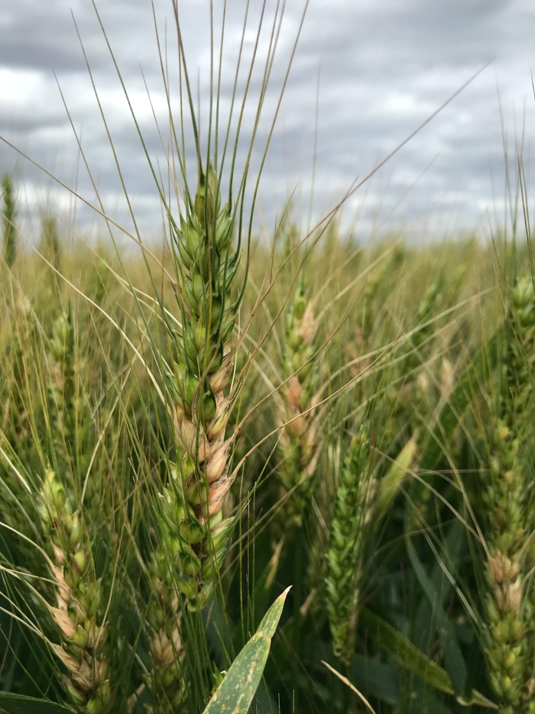
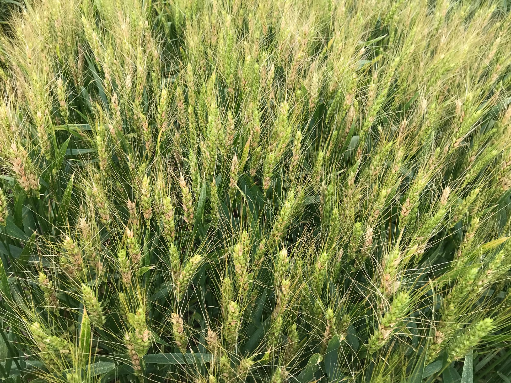

{style="float: right; margin-left: 20px;" width="303"}

# Weather-driven ensemble logistic models for Fusarium head blight of wheat in Brazil

###### Ana Carolyne Costa de Carvalho¹; Emerson Medeiros Del Ponte¹\*

###### ¹Departamento de Fitopatologia, Universidade Federal de Viçosa, Viçosa, MG, Brazil 36570-900

###### \* Author for correspondence: E-mail: delponte\@ufv.br

**Fusarium head blight (FHB)**, caused by members of the *Fusarium graminearum* species complex, is one of the main challenges for wheat production in southern Brazil. In this study, we applied a functional data analysis (FDA) approach to identify key weather conditions around flowering and to develop risk models predicting epidemics (FHB \> 10% severity; n = 125 cases). We found that mean relative humidity, minimum temperature, precipitation, and dew point temperature — especially within 2 to 10 days after the beginning of anthesis — were strongly linked to epidemic risk. Using these insights, we built logistic regression models with good predictive performance (ROC-AUC \> 0.79), and then combined them through ensemble approaches that further improved accuracy (ROC-AUC \> 0.81). An economic analysis based on Net Monetary Benefit (NMB) showed that fungicide use becomes economically viable mainly under moderate to high epidemic risk. Overall, the simplified models based on daily weather summaries during peak flowering offer practical tools to support FHB management in southern Brazil.

### 👉 **What you’ll find here**:

This repository gathers all the codes, scripts, and supporting documents used in the analyses. Everything is organized to make the workflow transparent and fully reproducible — from data preparation to statistical modeling and the economic evaluation.

### 👉 Read the Preprint

::: {.callout-note appearance="simple"}
Our pre-print is online on the agriRxiv preprint server:
Carvalho, A.C.C., Del Ponte, E.M. (2025). Weather-driven ensemble logistic models for predicting Fusarium head blight of wheat in Brazil. Online at https://doi.org/10.31220/agriRxiv.2025.00367

{width="366"}
